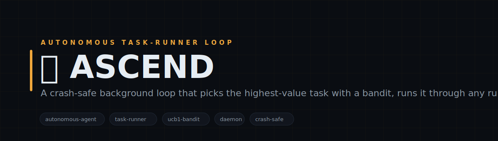
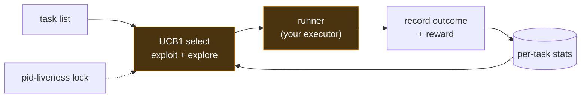

<!-- Autonomous Loop — white-label. No personal or company identifiers in this file by design. -->

<p align="center">
  
</p>

<h1 align="center">🛰️ Autonomous Loop</h1>

<p align="center">
  <b>A crash-safe background loop that picks the highest-value task with a bandit, runs it through any runner you plug in, records the outcome, and biases the next pick.</b><br>
  <sub>Autonomous Loop is the daemon that keeps an agent working on its own. Give it a list of tasks and a runner — a shell command, an agent CLI, any async function — and each cycle it selects one task with a UCB1 bandit (balancing proven winners against under-tried options), runs it under a wall-clock timeout, records the outcome and a reward, and updates the task's stats so the next pick is smarter. A pid-liveness lock means only one instance runs and a dead one never wedges the queue. Run one cycle, or loop forever on an interval as a service. Pure Node, zero dependencies, fail-open.</sub>
</p>

<p align="center">

= 18">

</p>

<p align="center">
<code>autonomous-agent</code> · <code>task-runner</code> · <code>ucb1-bandit</code> · <code>daemon</code> · <code>crash-safe</code> · <code>zero-deps</code>
</p>

---

## Why Autonomous Loop

Cron runs the same thing on a timer; an agent loop should choose. Autonomous Loop treats your task list as arms of a bandit: each cycle it picks the task with the best upper-confidence score — exploiting the ones that have paid off, exploring the ones it hasn't tried enough — runs it through a runner you control, and scores the result. Rewards update per-task stats, so over time the loop spends its cycles where they matter. It's crash-safe (a pid-liveness lock, not a timestamp, so a killed process is detected immediately and never blocks the next run), time-bounded (a hard per-cycle timeout kills a hung runner), and honest (every cycle appends an outcome record you can audit). Point the runner at `claude -p`, a test suite, a build, a scraper — anything that returns a result — and let it run.

---

## What it does

| Module | What it does | Signal |
|---|---|---|
| **bandit selector** | UCB1 picks the task with the best exploit/explore score from past rewards | spend cycles where they pay |
| **runner seam** | Runs the chosen task via any injected runner — shell command, agent CLI, async fn | bring your own executor |
| **pid-liveness lock** | One instance at a time; a dead PID is detected and never wedges the queue | crash-safe |

---

## Architecture



---

## Quickstart

```bash
# 1. no install needed — pure Node builtins
node lib/autonomous-loop.cjs --once            # run one cycle over the example tasks (shell runner)

# 2. loop forever on an interval (run as a service)
node lib/autonomous-loop.cjs --loop --interval=1800

# 3. see the bandit concentrate on the higher-reward task
node examples/demo.cjs

# 4. in your code — bring your own tasks + runner
#   const { runLoop } = require('./lib/autonomous-loop.cjs');
#   await runLoop({ tasks, runner: async (t) => ({ ok: true, output, reward }), once: true });
```

> Task stats + an outcome log persist to ./data (gitignored, auto-created). The default shell runner spawns task.cmd with a hard per-cycle timeout; inject your own runner to drive an agent CLI or any executor. A pid-liveness lock file keeps one loop alive; every stage is fail-open so a bad runner degrades rather than crashing the daemon.

---

## Repository layout

```
autonomous-loop/
├── lib/
│   └── autonomous-loop.cjs           ← the loop: UCB1 select → run → record, pid-liveness lock
├── examples/
│   ├── demo.cjs            ← in-process tasks with rewards; watch the bandit concentrate
│   └── tasks.example.json  ← a task list for the shell runner
└── data/                   ← per-task stats + outcome log (gitignored, auto-created)
```

---

## Design principles

1. **Choose, don't just fire.** A bandit spends cycles on the tasks that pay off while still exploring the rest — better than a fixed schedule.
2. **Bring your own executor.** The runner is one function; Autonomous Loop owns the loop, the lock, and the recording, not what a task does.
3. **Crash-safe by construction.** A pid-liveness lock detects a dead process instantly — a killed run never wedges the next one.
4. **Fail-open + auditable.** A throwing runner scores zero and the loop continues; every cycle appends an honest outcome record.

---

<p align="center"><sub>Autonomous Loop · select · run · record · MIT</sub></p>
