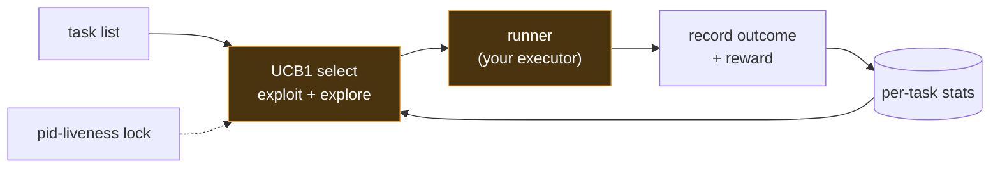

# Autonomous Loop — Architecture

Autonomous Loop is the daemon that keeps an agent working on its own. Give it a list of tasks and a runner — a shell command, an agent CLI, any async function — and each cycle it selects one task with a UCB1 bandit (balancing proven winners against under-tried options), runs it under a wall-clock timeout, records the outcome and a reward, and updates the task's stats so the next pick is smarter. A pid-liveness lock means only one instance runs and a dead one never wedges the queue. Run one cycle, or loop forever on an interval as a service. Pure Node, zero dependencies, fail-open.

## Flow

## How it fits together

Autonomous Loop is a crash-safe background loop. A pid-liveness lock (./data/autonomous-loop.lock holds the pid; a dead pid detected via process.kill(pid,0) is cleared immediately, not on a timeout) guarantees one instance. Each cycle: SELECT — a UCB1 bandit scores every task as avgReward + sqrt(2·ln(totalPlays)/plays) (unplayed tasks get priority), reading per-task stats from ./data/stats.json; RUN — the chosen task is passed to a runner `async (task, ctx) => { ok, output, reward? }` under a hard wall-clock timeout (the built-in shell runner spawns task.cmd; inject your own to drive an agent CLI or any executor); RECORD — the outcome appends to ./data/log.jsonl and the task's stats update (plays++, reward folded into the running average), so the next SELECT is better-informed. `runLoop({ tasks, runner, once, intervalMs, select })` drives it; the CLI adds --once / --loop / --interval / --dry-run. Every stage is guarded: a runner that throws scores 0 and the loop continues rather than crashing the daemon.

## Extending it

Every capability is a self-contained module. To add your own, follow the contract the existing
modules use and wire it into the entry point. Keep it portable — config via `.env`, no hardcoded
paths, no personal accounts.

## Design principles

1. **Choose, don't just fire.** A bandit spends cycles on the tasks that pay off while still exploring the rest — better than a fixed schedule.
2. **Bring your own executor.** The runner is one function; Autonomous Loop owns the loop, the lock, and the recording, not what a task does.
3. **Crash-safe by construction.** A pid-liveness lock detects a dead process instantly — a killed run never wedges the next one.
4. **Fail-open + auditable.** A throwing runner scores zero and the loop continues; every cycle appends an honest outcome record.
